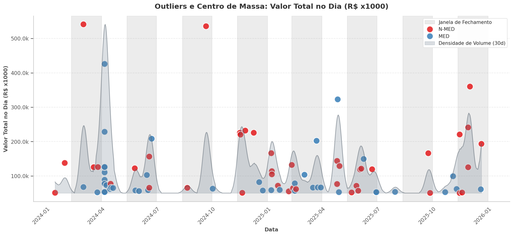
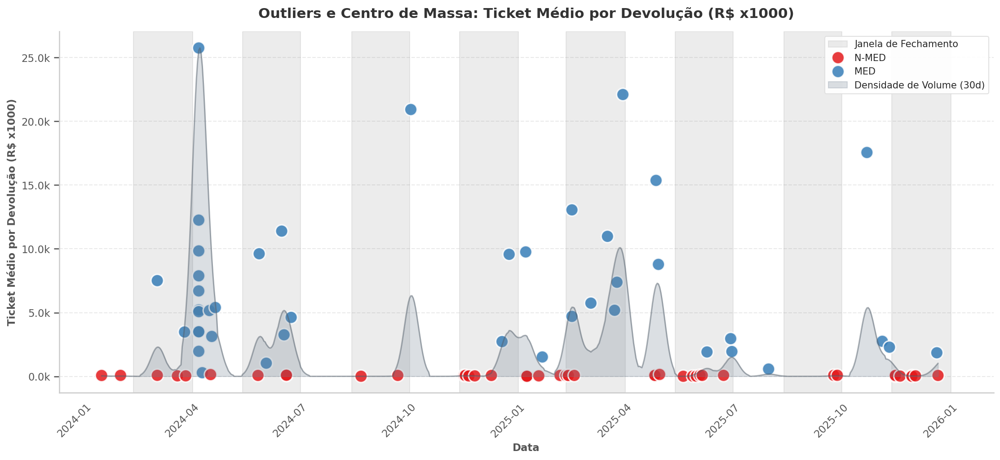

# Deep EDA: Análise de Picos e Sazonalidade em Devoluções

Este relatório apresenta uma visão aprofundada das devoluções da Panvel, focando na identificação de picos operacionais e na análise temporal de volume e ticket médio.

## 1. Picos Diários, "Centros de Massa" e o Efeito Trimestre
Mapeamos os outliers individuais (registros únicos de devolução com faturamento > 50k) de devolução sobrepostos à **Densidade de Volume Acumulado (Centro de Massa)**. O resultado revela um possível padrão operacional.

*A sobreposição da densidade (áreas em cinza) com as janelas de fechamento (faixas verticais) indicam visualmente que as "montanhas" de volume se formam quase que exclusivamente nas viradas de trimestres.*

- **Sincronia com o Fechamento de Calendário:** Aparentemente grandes repiques operacionais ocorrem dentro das **Janelas de Fechamento** (margem de +/- 10 dias em Março, Junho, Setembro e Dezembro). 
- **Comportamento Diferenciado por Categoria:**
  - **Valor Total (Volume Bruto):** Observamos picos massivos isolados chegando a mais de R$ 500k em um único dia. Embora ambas as categorias apresentem picos, itens **N-MED** (pontos vermelhos) são os grandes responsáveis pelos maiores volumes brutos descarregados de uma só vez.
  - **Ticket Médio (Valor Agregado):** Os outliers de altíssimo valor unitário (chegando a incríveis R$ 25k por devolução) são esmagadoramente dominados pela categoria **MED** (pontos azuis). 
