# EDA Summarized Reports

Este documento consolida as estatísticas iniciais da estrutura de dados com base nas queries de SUMMARIZE elaboradas no repositório.

## Tabela: `panvel__devolucoes`

### Valores Nulos (Missing Values)
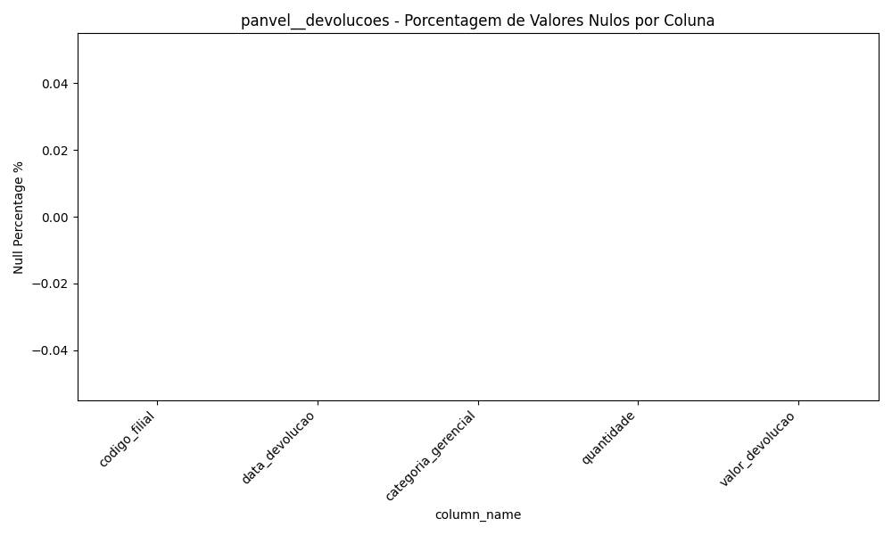
O gráfico apresenta a proporção de valores faltantes. Uma alta taxa de faltantes pode exigir tratamento de imputação de dados nas etapas posteriores.

### Cardinalidade (Valores Únicos)
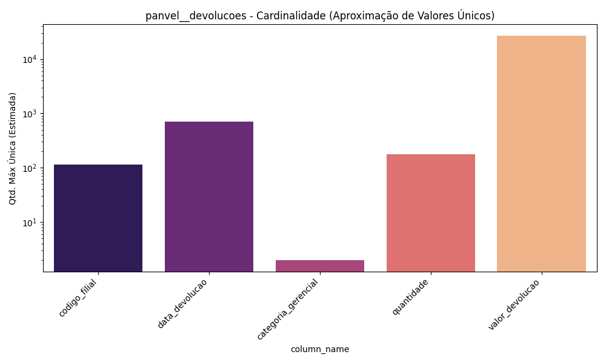
Este gráfico exibe a escala logarítmica de cardinalidade. Colunas de chaves tendem a apresentar picos elevados que refletem a granularidade total da base, enquanto atributos booleanos ficam na base.

### Tendência Numérica Média
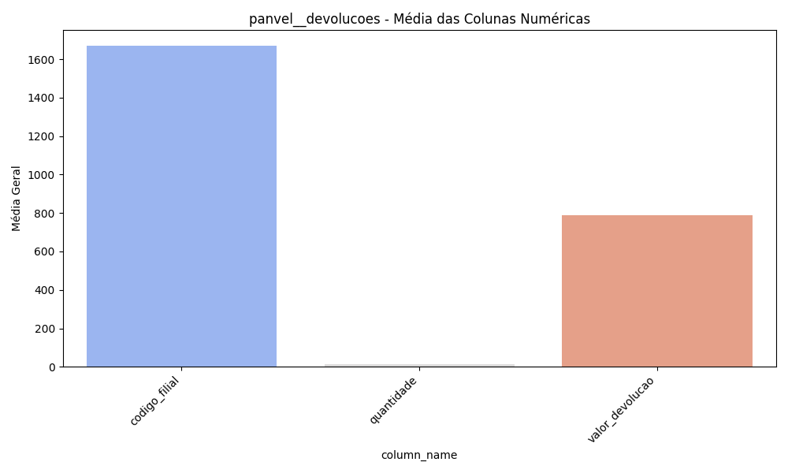
Acima as médias observadas nos atributos de cálculo direto. Estes valores servem como benchmark na hora da geração e conferência de novas métricas agregadas.

---

## Tabela: `panvel__filiais`

### Valores Nulos (Missing Values)
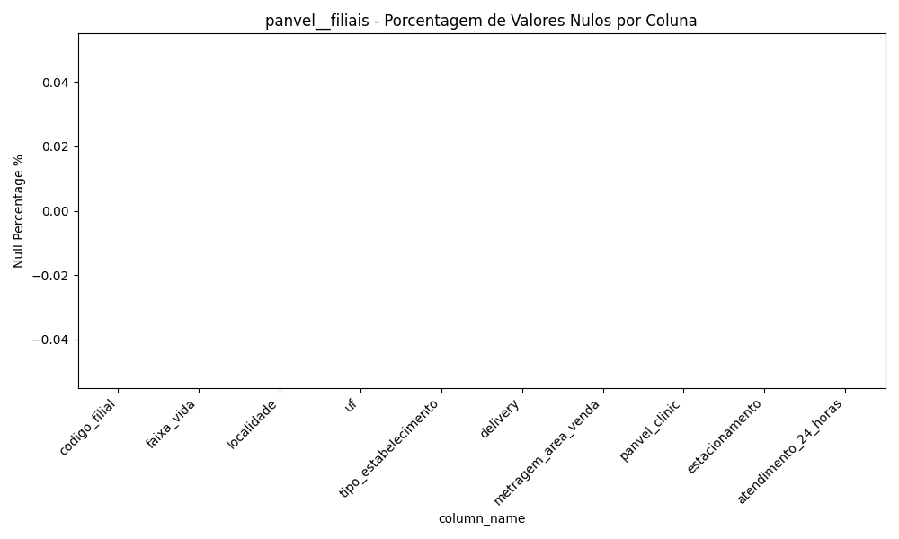
O gráfico apresenta a proporção de valores faltantes. Uma alta taxa de faltantes pode exigir tratamento de imputação de dados nas etapas posteriores.

### Cardinalidade (Valores Únicos)
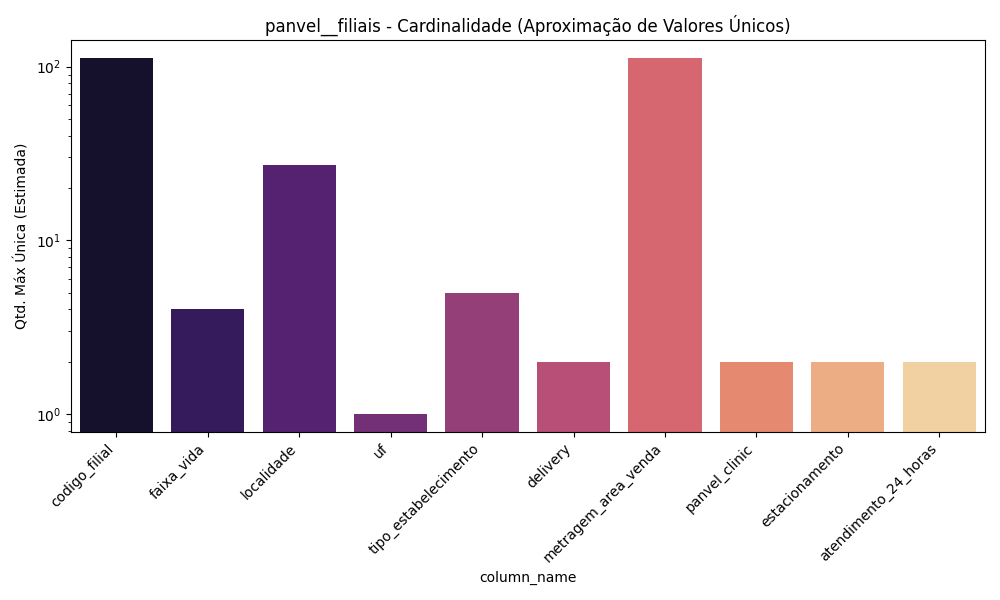
Este gráfico exibe a escala logarítmica de cardinalidade. Colunas de chaves tendem a apresentar picos elevados que refletem a granularidade total da base, enquanto atributos booleanos ficam na base.

### Tendência Numérica Média
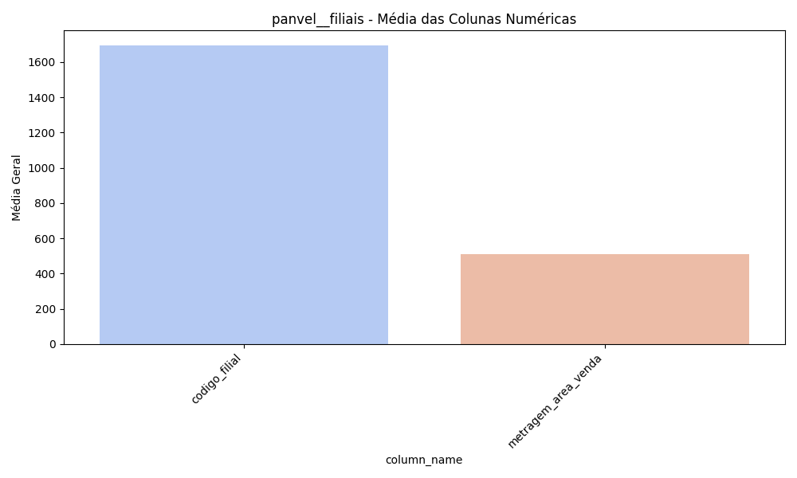
Acima as médias observadas nos atributos de cálculo direto. Estes valores servem como benchmark na hora da geração e conferência de novas métricas agregadas.

---

## Tabela: `panvel__metas`

### Valores Nulos (Missing Values)
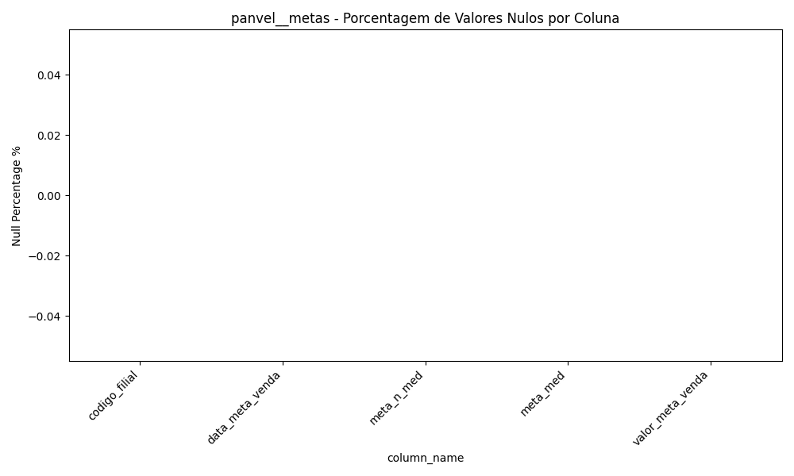
O gráfico apresenta a proporção de valores faltantes. Uma alta taxa de faltantes pode exigir tratamento de imputação de dados nas etapas posteriores.

### Cardinalidade (Valores Únicos)
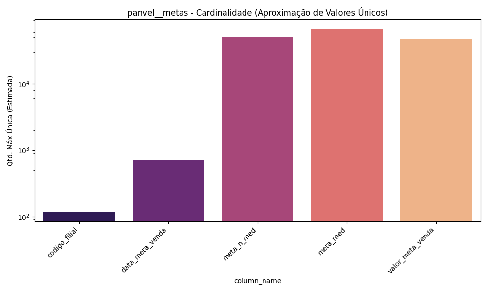
Este gráfico exibe a escala logarítmica de cardinalidade. Colunas de chaves tendem a apresentar picos elevados que refletem a granularidade total da base, enquanto atributos booleanos ficam na base.

### Tendência Numérica Média
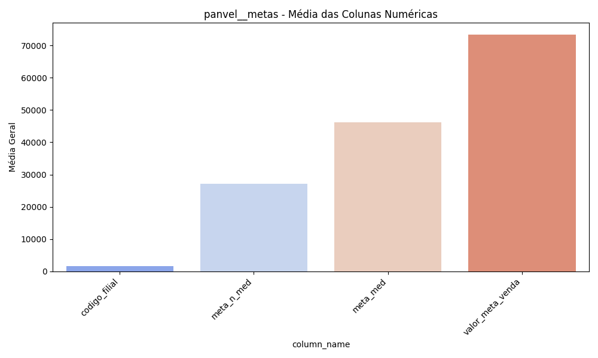
Acima as médias observadas nos atributos de cálculo direto. Estes valores servem como benchmark na hora da geração e conferência de novas métricas agregadas.

---

## Tabela: `panvel__vendas`

### Valores Nulos (Missing Values)
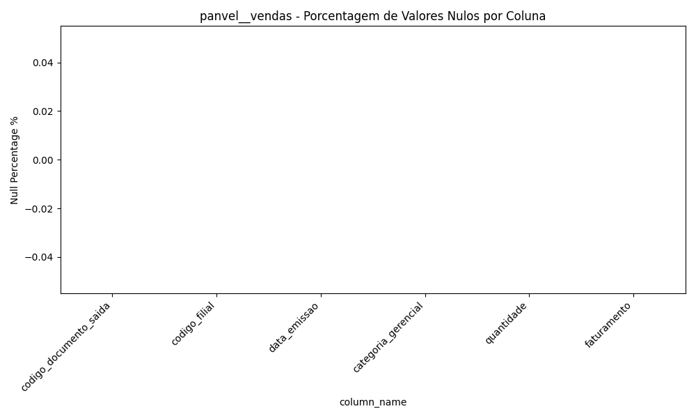
O gráfico apresenta a proporção de valores faltantes. Uma alta taxa de faltantes pode exigir tratamento de imputação de dados nas etapas posteriores.

### Cardinalidade (Valores Únicos)
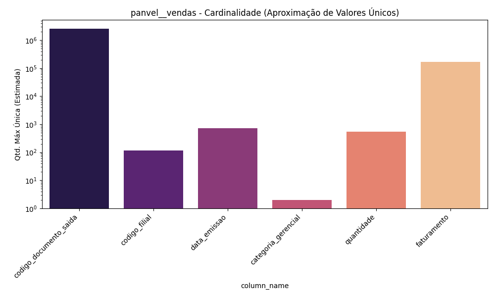
Este gráfico exibe a escala logarítmica de cardinalidade. Colunas de chaves tendem a apresentar picos elevados que refletem a granularidade total da base, enquanto atributos booleanos ficam na base.

### Tendência Numérica Média
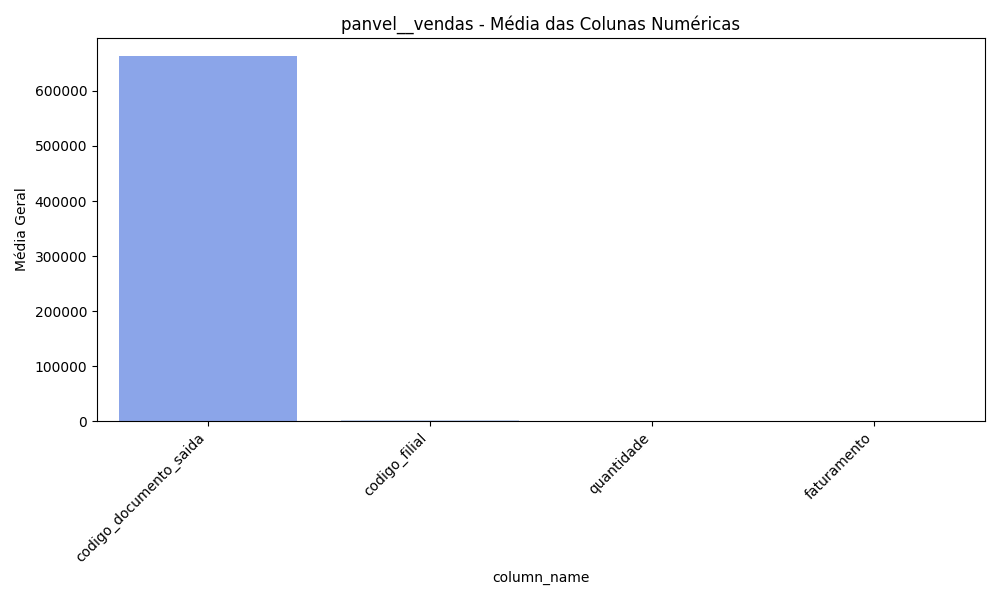
Acima as médias observadas nos atributos de cálculo direto. Estes valores servem como benchmark na hora da geração e conferência de novas métricas agregadas.

---

