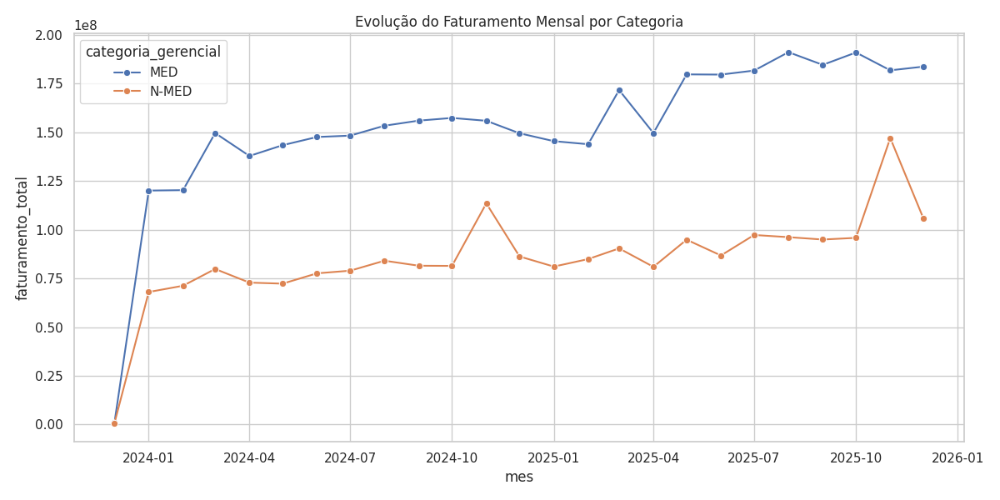
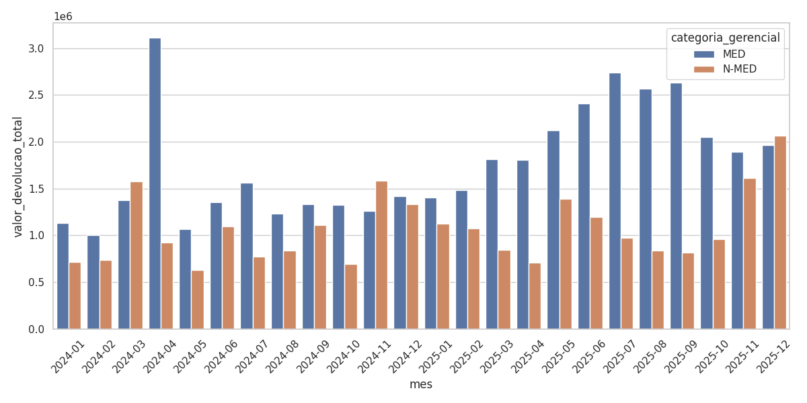
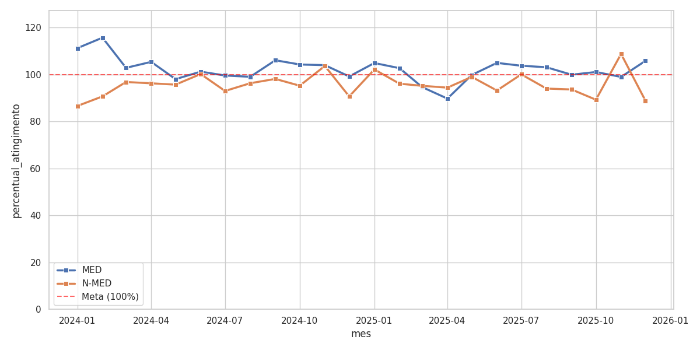

# EDA Categorical Analysis

Este relatório foca na segregação de performance entre as categorias **MED** e **N-MED**.

## 1. Evolução de Vendas

O gráfico acima mostra o faturamento mensal segmentado. Note a diferença de escala e sazonalidade entre produtos medicamentosos (MED) e não-medicamentosos (N-MED).

## 2. Devoluções por Categoria

Monitoramento do impacto financeiro das devoluções. Picos em categorias específicas podem indicar problemas de lote ou logística.

## 3. Atingimento de Meta (Sales / Goal %)

Análise crítica comparando o faturamento real versus a meta estipulada. A linha vermelha representa o cumprimento de 100% da meta.

